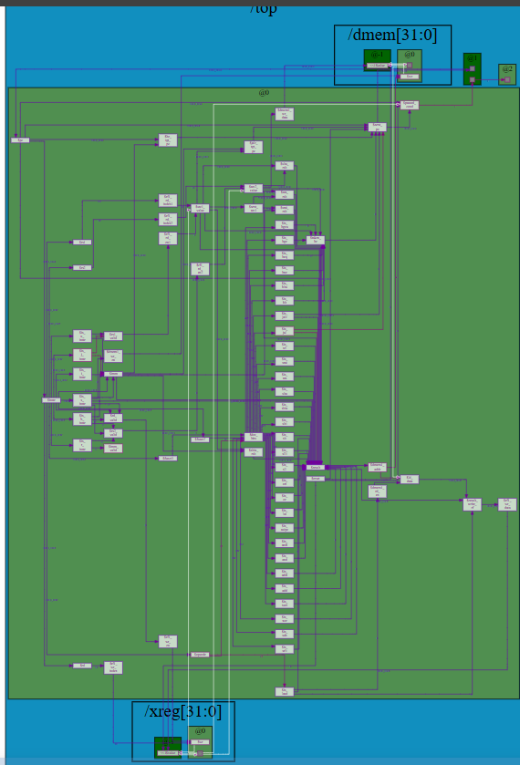

# RISC-V Core Implementation

This is my final implementation of a RISK-V core using TL-Verilog and the Makerchip IDE for the Linux Foundation Building a RISC-V CPU Core LFD111x.
## Overview

This repository contains a complete RISC-V core implementation that supports the RV32I base integer instruction set. 

## Features

- **RV32I Base Integer Instruction Set**: Full support for the 32-bit RISC-V base integer ISA
- **Modular Design**: Clean separation between fetch, decode, execute, memory, and writeback stages
- **Educational Focus**: Well-commented code designed for learning processor architecture
- **Simulation Ready**: Compatible with standard RISC-V toolchain and simulators
- **Extensible Architecture**: Designed to facilitate addition of extensions (M, A, F, D, etc.)

## Architecture

The core implements a classic 5-stage pipeline:
- **Instruction Fetch (IF)**: Fetches instructions from memory
- **Instruction Decode (ID)**: Decodes instructions and reads registers
- **Execute (EX)**: Performs arithmetic and logic operations
- **Memory Access (MEM)**: Handles load/store operations
- **Write Back (WB)**: Writes results back to register file

## Supported Instructions

### Integer Computational Instructions
- Arithmetic: `ADD`, `SUB`, `ADDI`
- Logical: `AND`, `OR`, `XOR`, `ANDI`, `ORI`, `XORI`
- Shift: `SLL`, `SRL`, `SRA`, `SLLI`, `SRLI`, `SRAI`
- Compare: `SLT`, `SLTU`, `SLTI`, `SLTIU`
- Upper Immediate: `LUI`, `AUIPC`

### Control Transfer Instructions
- Unconditional: `JAL`, `JALR`
- Conditional: `BEQ`, `BNE`, `BLT`, `BGE`, `BLTU`, `BGEU`

### Load/Store Instructions
- Load: `LB`, `LH`, `LW`, `LBU`, `LHU`
- Store: `SB`, `SH`, `SW`

## Resources

- [RISC-V Specification](https://riscv.org/specifications/)
- [Linux Foundation Training](https://training.linuxfoundation.org/)
- [RISC-V International](https://riscv.org/)

---

*This project is part of the Linux Foundation's educational initiative to build understanding of RISC-V processor architecture through hands-on implementation.*

